

**Weblate is a copylefted libre software web-based continuous localization system,
used by over 1150 libre projects and companies in more than 115 countries.**

# [📈 Live Status](https://status.weblate.org/): <!--live status--> **🟩 All systems operational**

This repository contains the open-source uptime monitor and status page for [Weblate](https://weblate.org/), powered by [Upptime](https://github.com/upptime/upptime).

With [Upptime](https://upptime.js.org), you can get your own unlimited and free uptime monitor and status page, powered entirely by a GitHub repository. We use [Issues](https://github.com/weblate-status-bot/status/issues) as incident reports, [Actions](https://github.com/weblate-status-bot/status/actions) as uptime monitors, and [Pages](https://status.weblate.org/) for the status page.

<!--start: status pages-->
<!-- This summary is generated by Upptime (https://github.com/upptime/upptime) -->
<!-- Do not edit this manually, your changes will be overwritten -->
<!-- prettier-ignore -->
| URL | Status | History | Response Time | Uptime |
| --- | ------ | ------- | ------------- | ------ |
|  [Hosted Weblate](https://hosted.weblate.org) | 🟩 Up | [hosted-weblate.yml](https://github.com/weblate-status-bot/status/commits/HEAD/history/hosted-weblate.yml) | 

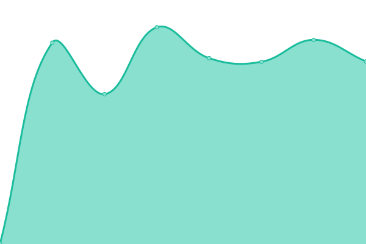 1416ms
     
 | 

<a href="https://status.weblate.org/history/hosted-weblate">100.00%</a>
    

|  [Weblate Care](https://care.weblate.org) | 🟩 Up | [weblate-care.yml](https://github.com/weblate-status-bot/status/commits/HEAD/history/weblate-care.yml) | 

 454ms
     
 | 

<a href="https://status.weblate.org/history/weblate-care">100.00%</a>
    

|  [Weblate Documentation](https://docs.weblate.org) | 🟩 Up | [weblate-documentation.yml](https://github.com/weblate-status-bot/status/commits/HEAD/history/weblate-documentation.yml) | 

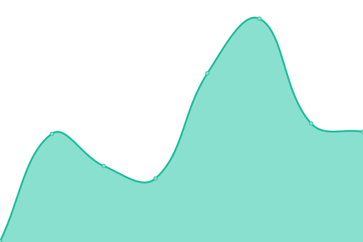 339ms
     
 | 

<a href="https://status.weblate.org/history/weblate-documentation">100.00%</a>
    

|  [Weblate website](https://weblate.org/en/) | 🟩 Up | [weblate-website.yml](https://github.com/weblate-status-bot/status/commits/HEAD/history/weblate-website.yml) | 

 560ms
     
 | 

<a href="https://status.weblate.org/history/weblate-website">100.00%</a>
    

|  [Weblate CDN](https://weblate-cdn.com/a5ba5dc29f39498aa734528a54b50d0a/weblate.js) | 🟩 Up | [weblate-cdn.yml](https://github.com/weblate-status-bot/status/commits/HEAD/history/weblate-cdn.yml) | 

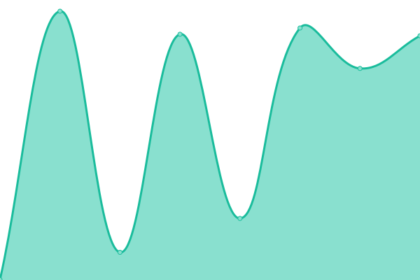 214ms
     
 | 

<a href="https://status.weblate.org/history/weblate-cdn">100.00%</a>
    

|  [Weblate Cloud Backup Service](backups.weblate.cloud) | 🟩 Up | [weblate-cloud-backup-service.yml](https://github.com/weblate-status-bot/status/commits/HEAD/history/weblate-cloud-backup-service.yml) | 

 172ms
     
 | 

<a href="https://status.weblate.org/history/weblate-cloud-backup-service">100.00%</a>
    

|  [Fedora Weblate](https://translate.fedoraproject.org/) | 🟩 Up | [fedora-weblate.yml](https://github.com/weblate-status-bot/status/commits/HEAD/history/fedora-weblate.yml) | 

 953ms
     
 | 

<a href="https://status.weblate.org/history/fedora-weblate">100.00%</a>
    

|  [Kodi Weblate](https://kodi.weblate.cloud/) | 🟩 Up | [kodi-weblate.yml](https://github.com/weblate-status-bot/status/commits/HEAD/history/kodi-weblate.yml) | 

 759ms
     
 | 

<a href="https://status.weblate.org/history/kodi-weblate">100.00%</a>
    

|  [Dyson Weblate](https://dyson.weblate.org/) | 🟩 Up | [dyson-weblate.yml](https://github.com/weblate-status-bot/status/commits/HEAD/history/dyson-weblate.yml) | 

 614ms
     
 | 

<a href="https://status.weblate.org/history/dyson-weblate">100.00%</a>
    

|  [EURid Weblate](https://weblate.eurid.eu/) | 🟩 Up | [eu-rid-weblate.yml](https://github.com/weblate-status-bot/status/commits/HEAD/history/eu-rid-weblate.yml) | 

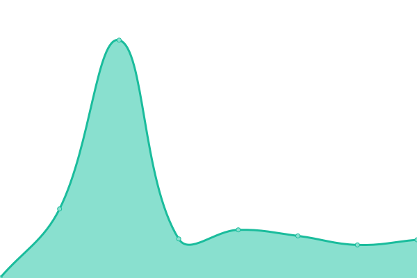 718ms
     
 | 

<a href="https://status.weblate.org/history/eu-rid-weblate">100.00%</a>
    

|  [EURid Weblate (staging)](https://weblate-test.eurid.eu/) | 🟩 Up | [eu-rid-weblate-staging.yml](https://github.com/weblate-status-bot/status/commits/HEAD/history/eu-rid-weblate-staging.yml) | 

 713ms
     
 | 

<a href="https://status.weblate.org/history/eu-rid-weblate-staging">100.00%</a>
    

|  [Solocoo Weblate](https://translate.solocoo.tv/) | 🟩 Up | [solocoo-weblate.yml](https://github.com/weblate-status-bot/status/commits/HEAD/history/solocoo-weblate.yml) | 

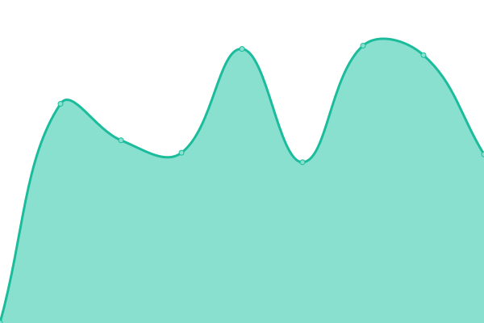 752ms
     
 | 

<a href="https://status.weblate.org/history/solocoo-weblate">100.00%</a>
    

|  [Lime Weblate](https://translate.lime.tech/) | 🟩 Up | [lime-weblate.yml](https://github.com/weblate-status-bot/status/commits/HEAD/history/lime-weblate.yml) | 

 694ms
     
 | 

<a href="https://status.weblate.org/history/lime-weblate">100.00%</a>
    

|  [Mattermost Weblate](https://translate.mattermost.com/) | 🟩 Up | [mattermost-weblate.yml](https://github.com/weblate-status-bot/status/commits/HEAD/history/mattermost-weblate.yml) | 

 688ms
     
 | 

<a href="https://status.weblate.org/history/mattermost-weblate">100.00%</a>
    

|  [Bon Weblate](https://bon.weblate.cloud/) | 🟩 Up | [bon-weblate.yml](https://github.com/weblate-status-bot/status/commits/HEAD/history/bon-weblate.yml) | 

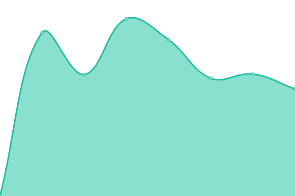 641ms
     
 | 

<a href="https://status.weblate.org/history/bon-weblate">100.00%</a>
    

|  [UL Weblate](https://ul.weblate.cloud/) | 🟩 Up | [ul-weblate.yml](https://github.com/weblate-status-bot/status/commits/HEAD/history/ul-weblate.yml) | 

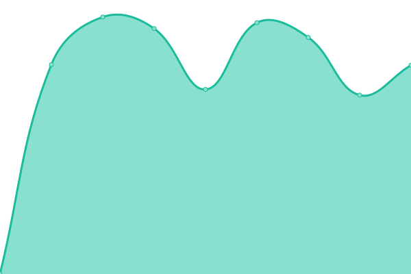 1036ms
     
 | 

<a href="https://status.weblate.org/history/ul-weblate">100.00%</a>
    

|  [Medvice Weblate](https://medvice.weblate.cloud/) | 🟩 Up | [medvice-weblate.yml](https://github.com/weblate-status-bot/status/commits/HEAD/history/medvice-weblate.yml) | 

 602ms
     
 | 

<a href="https://status.weblate.org/history/medvice-weblate">100.00%</a>
    

|  [Sourceability Weblate](https://sourceability.weblate.cloud/) | 🟩 Up | [sourceability-weblate.yml](https://github.com/weblate-status-bot/status/commits/HEAD/history/sourceability-weblate.yml) | 

 621ms
     
 | 

<a href="https://status.weblate.org/history/sourceability-weblate">100.00%</a>
    

|  [Vernier Weblate](https://vernier.weblate.cloud/) | 🟩 Up | [vernier-weblate.yml](https://github.com/weblate-status-bot/status/commits/HEAD/history/vernier-weblate.yml) | 

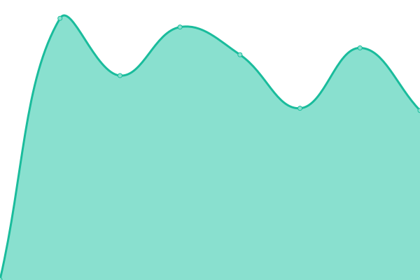 618ms
     
 | 

<a href="https://status.weblate.org/history/vernier-weblate">100.00%</a>
    

|  [Profil Klett Weblate](https://profil-klett.weblate.cloud/) | 🟩 Up | [profil-klett-weblate.yml](https://github.com/weblate-status-bot/status/commits/HEAD/history/profil-klett-weblate.yml) | 

 703ms
     
 | 

<a href="https://status.weblate.org/history/profil-klett-weblate">100.00%</a>
    

|  [Preventis Weblate](https://preventis.weblate.cloud/) | 🟩 Up | [preventis-weblate.yml](https://github.com/weblate-status-bot/status/commits/HEAD/history/preventis-weblate.yml) | 

 573ms
     
 | 

<a href="https://status.weblate.org/history/preventis-weblate">100.00%</a>
    

|  [SNOMED Weblate](https://translate.snomedtools.org/) | 🟩 Up | [snomed-weblate.yml](https://github.com/weblate-status-bot/status/commits/HEAD/history/snomed-weblate.yml) | 

 655ms
     
 | 

<a href="https://status.weblate.org/history/snomed-weblate">100.00%</a>
    

|  [Shopop Weblate](https://weblate.shopopop.com/) | 🟩 Up | [shopop-weblate.yml](https://github.com/weblate-status-bot/status/commits/HEAD/history/shopop-weblate.yml) | 

 732ms
     
 | 

<a href="https://status.weblate.org/history/shopop-weblate">99.79%</a>
    

|  [Shayp Weblate](https://weblate.shayp.io/) | 🟩 Up | [shayp-weblate.yml](https://github.com/weblate-status-bot/status/commits/HEAD/history/shayp-weblate.yml) | 

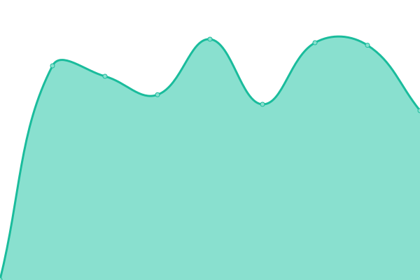 703ms
     
 | 

<a href="https://status.weblate.org/history/shayp-weblate">100.00%</a>
    

|  [Oxfam Weblate](https://oxfam.weblate.cloud/) | 🟩 Up | [oxfam-weblate.yml](https://github.com/weblate-status-bot/status/commits/HEAD/history/oxfam-weblate.yml) | 

 603ms
     
 | 

<a href="https://status.weblate.org/history/oxfam-weblate">99.79%</a>
    

|  [Universal Music Weblate](https://umusic.weblate.cloud/) | 🟩 Up | [universal-music-weblate.yml](https://github.com/weblate-status-bot/status/commits/HEAD/history/universal-music-weblate.yml) | 

 590ms
     
 | 

<a href="https://status.weblate.org/history/universal-music-weblate">100.00%</a>
    

|  [Doka Weblate](https://translation.umdaschgroup.com) | 🟩 Up | [doka-weblate.yml](https://github.com/weblate-status-bot/status/commits/HEAD/history/doka-weblate.yml) | 

 634ms
     
 | 

<a href="https://status.weblate.org/history/doka-weblate">100.00%</a>
    

|  [Manor Weblate](https://manor.weblate.cloud) | 🟩 Up | [manor-weblate.yml](https://github.com/weblate-status-bot/status/commits/HEAD/history/manor-weblate.yml) | 

 599ms
     
 | 

<a href="https://status.weblate.org/history/manor-weblate">100.00%</a>
    

|  [Proton Weblate](https://proton.weblate.cloud) | 🟩 Up | [proton-weblate.yml](https://github.com/weblate-status-bot/status/commits/HEAD/history/proton-weblate.yml) | 

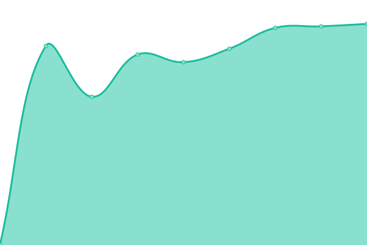 592ms
     
 | 

<a href="https://status.weblate.org/history/proton-weblate">100.00%</a>
    

|  [MetaBrainz Weblate](https://translations.metabrainz.org/) | 🟩 Up | [meta-brainz-weblate.yml](https://github.com/weblate-status-bot/status/commits/HEAD/history/meta-brainz-weblate.yml) | 

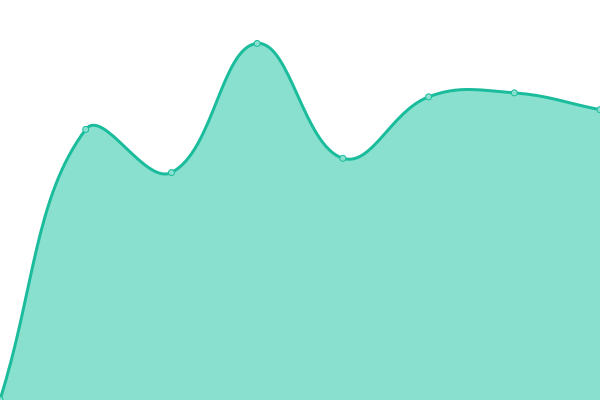 755ms
     
 | 

<a href="https://status.weblate.org/history/meta-brainz-weblate">100.00%</a>
    

|  [DGUV Weblate](https://weblate.dguv.de/) | 🟩 Up | [dguv-weblate.yml](https://github.com/weblate-status-bot/status/commits/HEAD/history/dguv-weblate.yml) | 

 920ms
     
 | 

<a href="https://status.weblate.org/history/dguv-weblate">100.00%</a>
    

<!--end: status pages-->

[**Visit our status website →**](https://status.weblate.org/)

## 📄 License

- Powered by: [Upptime](https://github.com/upptime/upptime)
- Code: [MIT](./LICENSE) © [Upptime](https://upptime.js.org)
- Data in the `./history` directory: [Open Database License](https://opendatacommons.org/licenses/odbl/1-0/)
