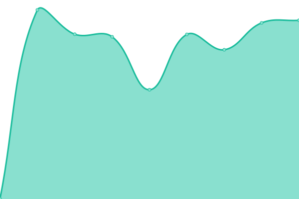
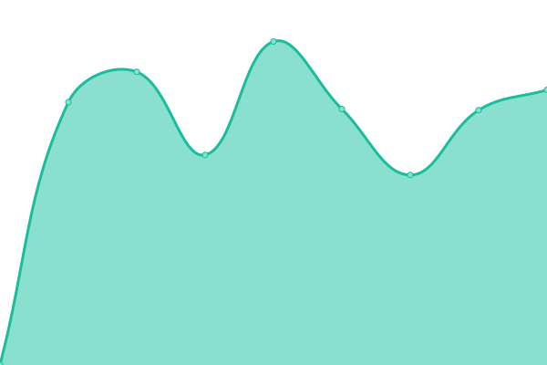

**Weblate is a copylefted libre software web-based continuous localization system,
used by over 1150 libre projects and companies in more than 115 countries.**

# [📈 Live Status](https://status.weblate.org/): <!--live status--> **🟧 Partial outage**

This repository contains the open-source uptime monitor and status page for [Weblate](https://weblate.org/), powered by [Upptime](https://github.com/upptime/upptime).

With [Upptime](https://upptime.js.org), you can get your own unlimited and free uptime monitor and status page, powered entirely by a GitHub repository. We use [Issues](https://github.com/weblate-status-bot/status/issues) as incident reports, [Actions](https://github.com/weblate-status-bot/status/actions) as uptime monitors, and [Pages](https://status.weblate.org/) for the status page.

<!--start: status pages-->
<!-- This summary is generated by Upptime (https://github.com/upptime/upptime) -->
<!-- Do not edit this manually, your changes will be overwritten -->
<!-- prettier-ignore -->
| URL | Status | History | Response Time | Uptime |
| --- | ------ | ------- | ------------- | ------ |
|  [Hosted Weblate](https://hosted.weblate.org) | 🟩 Up | [hosted-weblate.yml](https://github.com/weblate-status-bot/status/commits/HEAD/history/hosted-weblate.yml) | 

 821ms
     
 | 

<a href="https://status.weblate.org/history/hosted-weblate">100.00%</a>
    

|  [Weblate Care](https://care.weblate.org) | 🟩 Up | [weblate-care.yml](https://github.com/weblate-status-bot/status/commits/HEAD/history/weblate-care.yml) | 

 530ms
     
 | 

<a href="https://status.weblate.org/history/weblate-care">100.00%</a>
    

|  [Weblate Documentation](https://docs.weblate.org) | 🟩 Up | [weblate-documentation.yml](https://github.com/weblate-status-bot/status/commits/HEAD/history/weblate-documentation.yml) | 

 499ms
     
 | 

<a href="https://status.weblate.org/history/weblate-documentation">100.00%</a>
    

|  [Weblate website](https://weblate.org/en/) | 🟩 Up | [weblate-website.yml](https://github.com/weblate-status-bot/status/commits/HEAD/history/weblate-website.yml) | 

 629ms
     
 | 

<a href="https://status.weblate.org/history/weblate-website">100.00%</a>
    

|  [Weblate CDN](https://weblate-cdn.com/a5ba5dc29f39498aa734528a54b50d0a/weblate.js) | 🟩 Up | [weblate-cdn.yml](https://github.com/weblate-status-bot/status/commits/HEAD/history/weblate-cdn.yml) | 

 246ms
     
 | 

<a href="https://status.weblate.org/history/weblate-cdn">100.00%</a>
    

|  [Weblate Cloud Backup Service](backups.weblate.cloud) | 🟩 Up | [weblate-cloud-backup-service.yml](https://github.com/weblate-status-bot/status/commits/HEAD/history/weblate-cloud-backup-service.yml) | 

 264ms
     
 | 

<a href="https://status.weblate.org/history/weblate-cloud-backup-service">100.00%</a>
    

|  [Fedora Weblate](https://translate.fedoraproject.org/) | 🟥 Down | [fedora-weblate.yml](https://github.com/weblate-status-bot/status/commits/HEAD/history/fedora-weblate.yml) | 

 890ms
     
 | 

<a href="https://status.weblate.org/history/fedora-weblate">99.99%</a>
    

|  [Kodi Weblate](https://kodi.weblate.cloud/) | 🟩 Up | [kodi-weblate.yml](https://github.com/weblate-status-bot/status/commits/HEAD/history/kodi-weblate.yml) | 

 773ms
     
 | 

<a href="https://status.weblate.org/history/kodi-weblate">100.00%</a>
    

|  [Dyson Weblate](https://dyson.weblate.org/) | 🟩 Up | [dyson-weblate.yml](https://github.com/weblate-status-bot/status/commits/HEAD/history/dyson-weblate.yml) | 

 756ms
     
 | 

<a href="https://status.weblate.org/history/dyson-weblate">100.00%</a>
    

|  [EURid Weblate](https://weblate.eurid.eu/) | 🟩 Up | [eu-rid-weblate.yml](https://github.com/weblate-status-bot/status/commits/HEAD/history/eu-rid-weblate.yml) | 

 748ms
     
 | 

<a href="https://status.weblate.org/history/eu-rid-weblate">100.00%</a>
    

|  [EURid Weblate (staging)](https://weblate-test.eurid.eu/) | 🟩 Up | [eu-rid-weblate-staging.yml](https://github.com/weblate-status-bot/status/commits/HEAD/history/eu-rid-weblate-staging.yml) | 

 812ms
     
 | 

<a href="https://status.weblate.org/history/eu-rid-weblate-staging">100.00%</a>
    

|  [Solocoo Weblate](https://translate.solocoo.tv/) | 🟩 Up | [solocoo-weblate.yml](https://github.com/weblate-status-bot/status/commits/HEAD/history/solocoo-weblate.yml) | 

 705ms
     
 | 

<a href="https://status.weblate.org/history/solocoo-weblate">100.00%</a>
    

|  [Lime Weblate](https://translate.lime.tech/) | 🟩 Up | [lime-weblate.yml](https://github.com/weblate-status-bot/status/commits/HEAD/history/lime-weblate.yml) | 

 604ms
     
 | 

<a href="https://status.weblate.org/history/lime-weblate">100.00%</a>
    

|  [Mattermost Weblate](https://translate.mattermost.com/) | 🟩 Up | [mattermost-weblate.yml](https://github.com/weblate-status-bot/status/commits/HEAD/history/mattermost-weblate.yml) | 

 693ms
     
 | 

<a href="https://status.weblate.org/history/mattermost-weblate">100.00%</a>
    

|  [Bon Weblate](https://bon.weblate.cloud/) | 🟩 Up | [bon-weblate.yml](https://github.com/weblate-status-bot/status/commits/HEAD/history/bon-weblate.yml) | 

 578ms
     
 | 

<a href="https://status.weblate.org/history/bon-weblate">100.00%</a>
    

|  [UL Weblate](https://ul.weblate.cloud/) | 🟩 Up | [ul-weblate.yml](https://github.com/weblate-status-bot/status/commits/HEAD/history/ul-weblate.yml) | 

 1064ms
     
 | 

<a href="https://status.weblate.org/history/ul-weblate">100.00%</a>
    

|  [Medvice Weblate](https://medvice.weblate.cloud/) | 🟩 Up | [medvice-weblate.yml](https://github.com/weblate-status-bot/status/commits/HEAD/history/medvice-weblate.yml) | 

 619ms
     
 | 

<a href="https://status.weblate.org/history/medvice-weblate">100.00%</a>
    

|  [Sourceability Weblate](https://sourceability.weblate.cloud/) | 🟩 Up | [sourceability-weblate.yml](https://github.com/weblate-status-bot/status/commits/HEAD/history/sourceability-weblate.yml) | 

 577ms
     
 | 

<a href="https://status.weblate.org/history/sourceability-weblate">100.00%</a>
    

|  [Vernier Weblate](https://vernier.weblate.cloud/) | 🟩 Up | [vernier-weblate.yml](https://github.com/weblate-status-bot/status/commits/HEAD/history/vernier-weblate.yml) | 

 614ms
     
 | 

<a href="https://status.weblate.org/history/vernier-weblate">100.00%</a>
    

|  [Preventis Weblate](https://preventis.weblate.cloud/) | 🟩 Up | [preventis-weblate.yml](https://github.com/weblate-status-bot/status/commits/HEAD/history/preventis-weblate.yml) | 

 610ms
     
 | 

<a href="https://status.weblate.org/history/preventis-weblate">100.00%</a>
    

|  [SNOMED Weblate](https://translate.snomedtools.org/) | 🟩 Up | [snomed-weblate.yml](https://github.com/weblate-status-bot/status/commits/HEAD/history/snomed-weblate.yml) | 

 740ms
     
 | 

<a href="https://status.weblate.org/history/snomed-weblate">100.00%</a>
    

|  [Shopop Weblate](https://weblate.shopopop.com/) | 🟩 Up | [shopop-weblate.yml](https://github.com/weblate-status-bot/status/commits/HEAD/history/shopop-weblate.yml) | 

 582ms
     
 | 

<a href="https://status.weblate.org/history/shopop-weblate">100.00%</a>
    

|  [Shayp Weblate](https://weblate.shayp.io/) | 🟩 Up | [shayp-weblate.yml](https://github.com/weblate-status-bot/status/commits/HEAD/history/shayp-weblate.yml) | 

 754ms
     
 | 

<a href="https://status.weblate.org/history/shayp-weblate">100.00%</a>
    

|  [Oxfam Weblate](https://oxfam.weblate.cloud/) | 🟩 Up | [oxfam-weblate.yml](https://github.com/weblate-status-bot/status/commits/HEAD/history/oxfam-weblate.yml) | 

 601ms
     
 | 

<a href="https://status.weblate.org/history/oxfam-weblate">100.00%</a>
    

|  [Universal Music Weblate](https://umusic.weblate.cloud/) | 🟩 Up | [universal-music-weblate.yml](https://github.com/weblate-status-bot/status/commits/HEAD/history/universal-music-weblate.yml) | 

 667ms
     
 | 

<a href="https://status.weblate.org/history/universal-music-weblate">100.00%</a>
    

|  [Doka Weblate](https://translation.umdaschgroup.com) | 🟩 Up | [doka-weblate.yml](https://github.com/weblate-status-bot/status/commits/HEAD/history/doka-weblate.yml) | 

 693ms
     
 | 

<a href="https://status.weblate.org/history/doka-weblate">100.00%</a>
    

|  [Manor Weblate](https://manor.weblate.cloud) | 🟩 Up | [manor-weblate.yml](https://github.com/weblate-status-bot/status/commits/HEAD/history/manor-weblate.yml) | 

 652ms
     
 | 

<a href="https://status.weblate.org/history/manor-weblate">100.00%</a>
    

|  [MetaBrainz Weblate](https://translations.metabrainz.org/) | 🟩 Up | [meta-brainz-weblate.yml](https://github.com/weblate-status-bot/status/commits/HEAD/history/meta-brainz-weblate.yml) | 

 758ms
     
 | 

<a href="https://status.weblate.org/history/meta-brainz-weblate">100.00%</a>
    

|  [DGUV Weblate](https://weblate.dguv.de/) | 🟩 Up | [dguv-weblate.yml](https://github.com/weblate-status-bot/status/commits/HEAD/history/dguv-weblate.yml) | 

 794ms
     
 | 

<a href="https://status.weblate.org/history/dguv-weblate">100.00%</a>
    

|  [Pascom Weblate](https://translate.pascom.net/) | 🟩 Up | [pascom-weblate.yml](https://github.com/weblate-status-bot/status/commits/HEAD/history/pascom-weblate.yml) | 

 687ms
     
 | 

<a href="https://status.weblate.org/history/pascom-weblate">100.00%</a>
    

|  [Artefactual's Weblate](https://translations.artefactual.com/) | 🟩 Up | [artefactual-s-weblate.yml](https://github.com/weblate-status-bot/status/commits/HEAD/history/artefactual-s-weblate.yml) | 

 709ms
     
 | 

<a href="https://status.weblate.org/history/artefactual-s-weblate">100.00%</a>
    

|  [LS Weblate](https://tmhe.weblate.cloud/) | 🟩 Up | [ls-weblate.yml](https://github.com/weblate-status-bot/status/commits/HEAD/history/ls-weblate.yml) | 

 643ms
     
 | 

<a href="https://status.weblate.org/history/ls-weblate">100.00%</a>
    

|  [Salling Weblate](https://salling.weblate.cloud/) | 🟩 Up | [salling-weblate.yml](https://github.com/weblate-status-bot/status/commits/HEAD/history/salling-weblate.yml) | 

 590ms
     
 | 

<a href="https://status.weblate.org/history/salling-weblate">100.00%</a>
    

|  [Oculavis Weblate](https://weblate.oculavis.de/) | 🟩 Up | [oculavis-weblate.yml](https://github.com/weblate-status-bot/status/commits/HEAD/history/oculavis-weblate.yml) | 

 878ms
     
 | 

<a href="https://status.weblate.org/history/oculavis-weblate">100.00%</a>
    

|  [GetMomo Weblate](https://weblate.getmomo.net/) | 🟩 Up | [get-momo-weblate.yml](https://github.com/weblate-status-bot/status/commits/HEAD/history/get-momo-weblate.yml) | 

 650ms
     
 | 

<a href="https://status.weblate.org/history/get-momo-weblate">100.00%</a>
    

|  [Teamhero Weblate](https://wl.teamhero.de/) | 🟩 Up | [teamhero-weblate.yml](https://github.com/weblate-status-bot/status/commits/HEAD/history/teamhero-weblate.yml) | 

 866ms
     
 | 

<a href="https://status.weblate.org/history/teamhero-weblate">100.00%</a>
    

|  [webit Weblate](https://webit.weblate.cloud/) | 🟩 Up | [webit-weblate.yml](https://github.com/weblate-status-bot/status/commits/HEAD/history/webit-weblate.yml) | 

 709ms
     
 | 

<a href="https://status.weblate.org/history/webit-weblate">100.00%</a>
    

|  [Schiller Weblate](https://translate.schiller.fr/) | 🟩 Up | [schiller-weblate.yml](https://github.com/weblate-status-bot/status/commits/HEAD/history/schiller-weblate.yml) | 

 1029ms
     
 | 

<a href="https://status.weblate.org/history/schiller-weblate">100.00%</a>
    

|  [Stem Weblate](https://weblate.stem.com/) | 🟩 Up | [stem-weblate.yml](https://github.com/weblate-status-bot/status/commits/HEAD/history/stem-weblate.yml) | 

 688ms
     
 | 

<a href="https://status.weblate.org/history/stem-weblate">100.00%</a>
    

|  [Spaziodati Weblate](https://spaziodati.weblate.cloud/) | 🟩 Up | [spaziodati-weblate.yml](https://github.com/weblate-status-bot/status/commits/HEAD/history/spaziodati-weblate.yml) | 

 649ms
     
 | 

<a href="https://status.weblate.org/history/spaziodati-weblate">100.00%</a>
    

|  [Papirfly Weblate](https://papirfly.weblate.cloud/) | 🟩 Up | [papirfly-weblate.yml](https://github.com/weblate-status-bot/status/commits/HEAD/history/papirfly-weblate.yml) | 

 1231ms
     
 | 

<a href="https://status.weblate.org/history/papirfly-weblate">100.00%</a>
    

|  [Viking Weblate](https://viking.weblate.cloud/) | 🟩 Up | [viking-weblate.yml](https://github.com/weblate-status-bot/status/commits/HEAD/history/viking-weblate.yml) | 

 558ms
     
 | 

<a href="https://status.weblate.org/history/viking-weblate">100.00%</a>
    

|  [Syncron Weblate](https://syncron.weblate.cloud/) | 🟩 Up | [syncron-weblate.yml](https://github.com/weblate-status-bot/status/commits/HEAD/history/syncron-weblate.yml) | 

 561ms
     
 | 

<a href="https://status.weblate.org/history/syncron-weblate">100.00%</a>
    

|  [VUTG Weblate](https://weblate.vutg.be/) | 🟩 Up | [vutg-weblate.yml](https://github.com/weblate-status-bot/status/commits/HEAD/history/vutg-weblate.yml) | 

 866ms
     
 | 

<a href="https://status.weblate.org/history/vutg-weblate">100.00%</a>
    

|  [AUVESY Weblate](https://weblate.auvesy-mdt.com/) | 🟩 Up | [auvesy-weblate.yml](https://github.com/weblate-status-bot/status/commits/HEAD/history/auvesy-weblate.yml) | 

 766ms
     
 | 

<a href="https://status.weblate.org/history/auvesy-weblate">100.00%</a>
    

|  [OpenStack Weblate](https://openstack.weblate.cloud/) | 🟩 Up | [open-stack-weblate.yml](https://github.com/weblate-status-bot/status/commits/HEAD/history/open-stack-weblate.yml) | 

 566ms
     
 | 

<a href="https://status.weblate.org/history/open-stack-weblate">100.00%</a>
    

|  [BuildingLink Weblate](https://buildinglink.weblate.cloud/) | 🟩 Up | [building-link-weblate.yml](https://github.com/weblate-status-bot/status/commits/HEAD/history/building-link-weblate.yml) | 

 556ms
     
 | 

<a href="https://status.weblate.org/history/building-link-weblate">100.00%</a>
    

|  [Qosenergy Weblate](https://weblate.qosenergy.it/) | 🟩 Up | [qosenergy-weblate.yml](https://github.com/weblate-status-bot/status/commits/HEAD/history/qosenergy-weblate.yml) | 

 800ms
     
 | 

<a href="https://status.weblate.org/history/qosenergy-weblate">100.00%</a>
    

|  [SAS Weblate](https://weblate.santanderauto.systems/) | 🟩 Up | [sas-weblate.yml](https://github.com/weblate-status-bot/status/commits/HEAD/history/sas-weblate.yml) | 

 583ms
     
 | 

<a href="https://status.weblate.org/history/sas-weblate">100.00%</a>
    

|  [AIDU Weblate](https://aidu.weblate.cloud/) | 🟩 Up | [aidu-weblate.yml](https://github.com/weblate-status-bot/status/commits/HEAD/history/aidu-weblate.yml) | 

 579ms
     
 | 

<a href="https://status.weblate.org/history/aidu-weblate">100.00%</a>
    

|  [RDS Weblate](https://rds.weblate.cloud/) | 🟩 Up | [rds-weblate.yml](https://github.com/weblate-status-bot/status/commits/HEAD/history/rds-weblate.yml) | 

 574ms
     
 | 

<a href="https://status.weblate.org/history/rds-weblate">100.00%</a>
    

|  [MoJ Weblate](https://moj.weblate.cloud/) | 🟩 Up | [mo-j-weblate.yml](https://github.com/weblate-status-bot/status/commits/HEAD/history/mo-j-weblate.yml) | 

 596ms
     
 | 

<a href="https://status.weblate.org/history/mo-j-weblate">100.00%</a>
    

|  [UN EP Weblate](https://unep.weblate.cloud/) | 🟩 Up | [un-ep-weblate.yml](https://github.com/weblate-status-bot/status/commits/HEAD/history/un-ep-weblate.yml) | 

 547ms
     
 | 

<a href="https://status.weblate.org/history/un-ep-weblate">100.00%</a>
    

<!--end: status pages-->

[**Visit our status website →**](https://status.weblate.org/)

## 📄 License

- Powered by: [Upptime](https://github.com/upptime/upptime)
- Code: [MIT](./LICENSE) © [Upptime](https://upptime.js.org)
- Data in the `./history` directory: [Open Database License](https://opendatacommons.org/licenses/odbl/1-0/)
